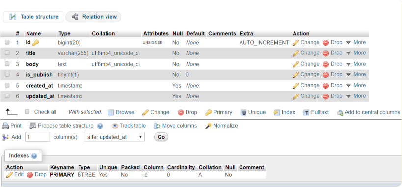

# laravel9_how_to_create_migration
cách tạo bảng cơ sở dữ liệu bằng cách sử dụng di chuyển laravel. chúng ta sẽ sử dụng lệnh laravel 9 để tạo di chuyển cho bảng.
Create Migration:
```Dockerfile
php artisan make:migration create_posts_table
```
- Vào database/migrations/2022_02_17_133331_create_posts_table.php
```Dockerfile
<?php
  
use Illuminate\Database\Migrations\Migration;
use Illuminate\Database\Schema\Blueprint;
use Illuminate\Support\Facades\Schema;
  
return new class extends Migration
{
    /**
     * Run the migrations.
     *
     * @return void
     */
    public function up()
    {
        Schema::create('posts', function (Blueprint $table) {
            $table->id();
            $table->string('title');
            $table->text('body');
            $table->boolean('is_publish')->default(0);
            $table->timestamps();
        });
    }
  
    /**
     * Reverse the migrations.
     *
     * @return void
     */
    public function down()
    {
        Schema::dropIfExists('posts');
    }
};
```
Run Migration:
```Dockerfile
php artisan migrate
```


Create Migration with Table:
```Dockerfile
php artisan make:migration create_posts_table --table=posts
```
Run Specific Migration:
```Dockerfile
php artisan migrate --path=/database/migrations/2020_04_01_064006_create_posts_table.php
```
Migration Rollback:
```Dockerfile
php artisan migrate:rollback
```

